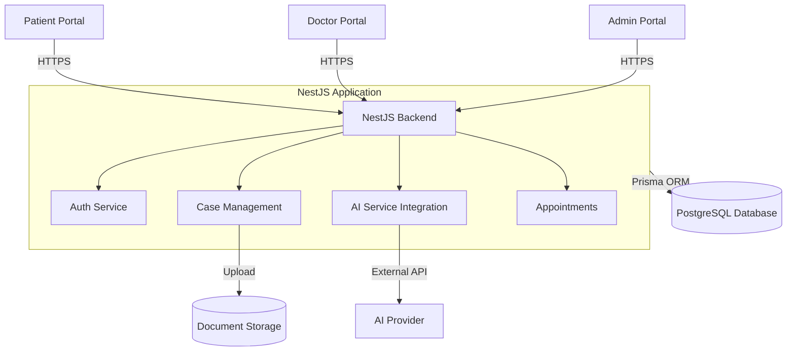

# 05 - Technical Architecture

## 1. System Overview
The HomeoOpinion platform follows a modern decoupled architecture, utilizing a Next.js frontend, a NestJS backend, and a PostgreSQL database. The system is designed to securely handle sensitive medical data while providing an intuitive experience for Patients, Doctors, and Administrators.

## 2. Technology Stack

### Frontend (User Interface)
*   **Framework**: Next.js (React)
*   **Language**: TypeScript
*   **Styling**: Tailwind CSS
*   **State Management**: React Hooks & Context API (or specific state libraries if used)
*   **Routing**: Next.js App Router (`/src/app/...`)
*   **Portals**:
    *   `/patient`: Intake, document upload, appointment viewing.
    *   `/doctor`: Queue management, AI preliminary report review, prescription generation.
    *   `/admin`: System oversight, user role management.

### Backend (API Services)
*   **Framework**: NestJS
*   **Language**: TypeScript
*   **Authentication**: Passport.js with JWT strategies
*   **Modules**:
    *   `AuthModule`: Handles login, registration, and token validation.
    *   `UsersModule`: Manages user profiles and roles.
    *   `CasesModule`: Manages patient case submissions and file references.
    *   `AppointmentsModule`: Manages scheduling.
    *   `AIModule`: Interacts with AI services/mocks for preliminary reports.

### Database & ORM
*   **Database**: PostgreSQL
*   **ORM**: Prisma
*   **Key Entities**: User, Role, Case, Appointment, Document, Prescription.

## 3. High-Level Architecture Diagram

## 4. Security & Compliance
*   **Role-Based Access Control (RBAC)**: Enforced via NestJS Guards on backend endpoints and protected routes in Next.js.
*   **Data Validation**: Strict validation using `class-validator` in NestJS and form validation on the frontend.
*   **Authentication**: Bearer tokens via JWT.

## 5. Deployment Strategy (Conceptual)
*   **Frontend**: Deployed via Vercel or Node.js Docker container.
*   **Backend**: Containerized (Docker) and deployed on a scalable cloud provider (e.g., AWS, GCP, Azure).
*   **Database**: Managed PostgreSQL instance (e.g., AWS RDS).
