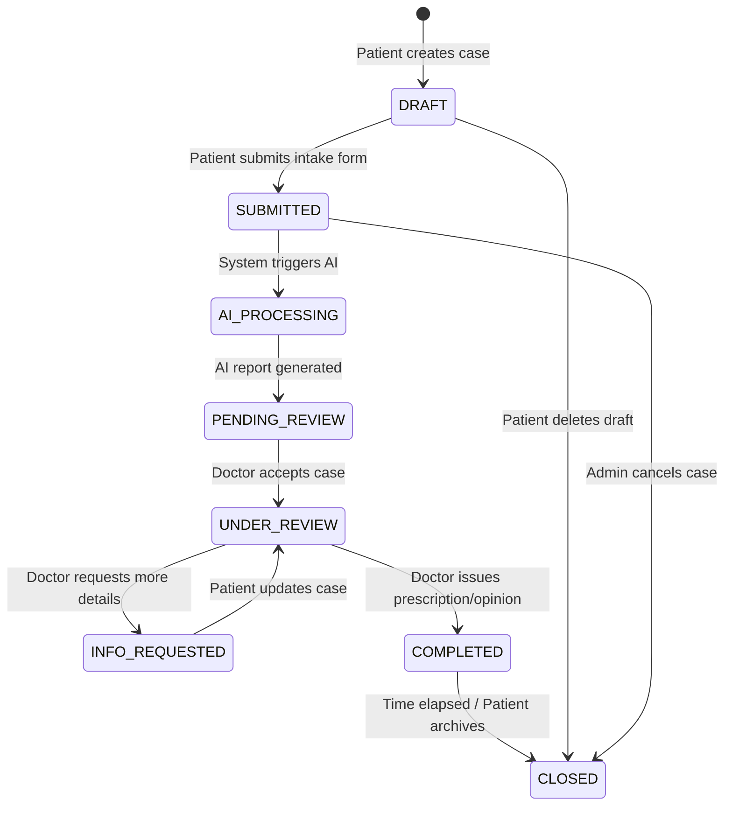

# HomeoOpinion — Patient Case State Machine

This document defines the lifecycle states and transitions of a Patient Case in the HomeoOpinion platform.

## Case States

1. **`DRAFT`**: The patient has started filling out the intake form but has not yet submitted it.
2. **`SUBMITTED`**: The patient has completed the form and uploaded necessary documents. The case is now in the system queue.
3. **`AI_PROCESSING`**: The system is currently generating a preliminary AI report based on the submitted symptoms and history.
4. **`PENDING_REVIEW`**: The AI report is ready. The case is waiting for a Doctor to pick it up from the queue.
5. **`UNDER_REVIEW`**: A Doctor has assigned the case to themselves and is currently analyzing the information and the AI report.
6. **`INFO_REQUESTED`**: The Doctor requires more information or clearer documents from the patient before providing a prescription.
7. **`COMPLETED`**: The Doctor has finalized their review and issued an E-Prescription or final opinion.
8. **`CLOSED`**: The case lifecycle is fully terminated (e.g., follow-up period has expired or the patient has archived it).

## State Machine Diagram

## Key Transitions & Notifications

- **`SUBMITTED` → `PENDING_REVIEW`**: Once the AI report is attached, Doctors receive a notification of a new available case.
- **`UNDER_REVIEW` → `INFO_REQUESTED`**: The Patient receives an email/notification that the Doctor needs more details.
- **`UNDER_REVIEW` → `COMPLETED`**: The Patient receives their final Homeopathic opinion and e-prescription via email/notification.
